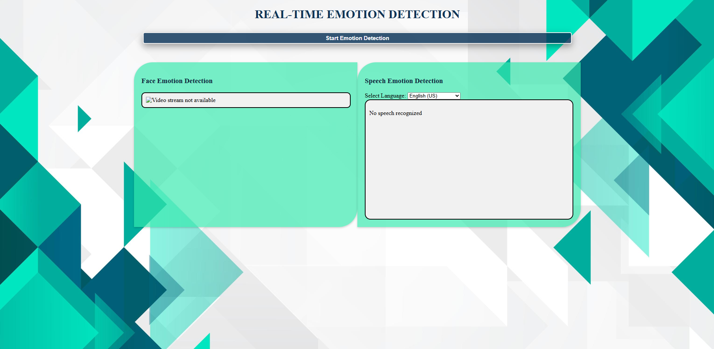

## How to Run

1. Clone the repository

git clone https://github.com/AbinPP/face-emotion-recognition-speech-analysis-medical-contexts

2. Install dependencies

pip install -r requirements.txt

3. Run the application

python app.py

